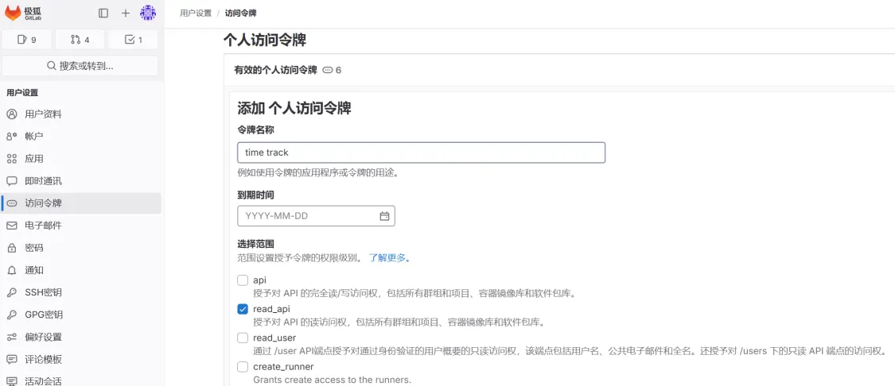
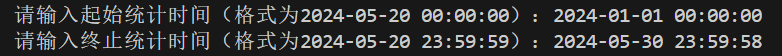
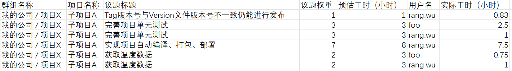
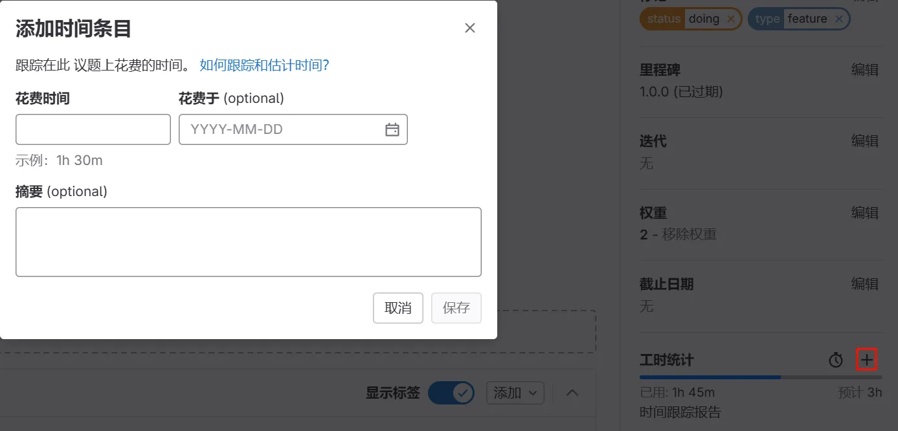

## 项目简介
该项目用于获取项目中的工时信息，并按照 `["群组名称", "项目名称", "议题标题", "议题权重", "预估工时（小时）",  "用户名", "实际工时（小时）"]` 维度进行统计。

## 项目依赖
1. python 3.6及以上版本。

## 使用方式

1. 克隆项目到本地。
2. 使用GitLab管理员账号，创建Access Token，勾选`read_api`范围。你可以使用个人账号创建Access Token，那么只能导出这个账号有权限的项目的工时信息。你也可以使用[群组AccesToken](https://docs.gitlab.cn/jh/user/group/settings/group_access_tokens.html)，这样只会导出这个群组下所有项目的工时信息。
   
3. 修改配置文件 `gitlab.cfg` ，修改以下内容：
    ``` cfg
    # GitLab URL
    url = https://example.jihulab.com
    # 管理员账号 Access Token
    private_token = glpxxxxxxxxs
    ```
4. 安装依赖：
    ``` shell
    pip install python-gitlab
    pip install requests
    pip install pytz
    ```
5. 运行程序 `python main.py`，输入需要统计的起止时间，等待程序执行完成。
   
6. 打开 `report.csv` ，查看导出结果。
   

## 其他说明
1. 导出的CSV文件为GBK编码，请用Excel或同类型工具打开。
2. 仅统计在起止时间内上报的工时。若上报工时时没有填写“花费于”，则该工时的上报时间默认为当前时间；如果填写了“花费于”，则使用输入的时间作为上报时间。
   
3. 该程序为非GitLab官方支持工具，仅供学习参考，产生的任何问题不在GitLab服务范围内。